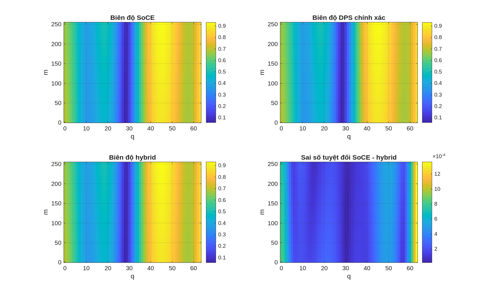

# Mô phỏng kênh MIMO băng rộng sử dụng biểu diễn DPS

Repository chứa đồ án tốt nghiệp LaTeX và mã MATLAB nghiên cứu phương pháp mô phỏng kênh MIMO băng rộng dựa trên hình học có độ phức tạp thấp. Nội dung được xây dựng từ bài báo:

> Florian Kaltenberger, Thomas Zemen và Christoph W. Ueberhuber, “Low-Complexity Geometry-Based MIMO Channel Simulation”, EURASIP Journal on Advances in Signal Processing, 2007.

Mục tiêu của dự án là giữ nhất quán giữa:

- mô hình và phương trình trong báo cáo;
- cách triển khai các nhánh SoCE/DPS trong MATLAB;
- tham số mô phỏng;
- hình, bảng và nhận xét định lượng.

## Ý tưởng chính

Mô hình kênh dựa trên hình học (Geometry-based Channel Model, GCM) biểu diễn kênh bằng tổng đóng góp của nhiều thành phần đa đường (Multipath Component, MPC). Sau khi lấy mẫu, kênh MIMO băng rộng có dạng tổng các hàm mũ phức (Sum of Complex Exponentials, SoCE):

\[
h_{m,q,s,r}
=
\sum_{p=0}^{P-1}
\eta_p
e^{j2\pi(\nu_p m-\theta_p q+\zeta_p s-\xi_p r)}.
\]

SoCE phải cộng toàn bộ MPC tại từng điểm của khối kênh bốn chiều gồm thời gian, tần số, anten phát và anten thu. Chi phí trực tiếp vì vậy tăng theo:

\[
\mathcal{O}\!\left(MQN_{\mathrm{Tx}}N_{\mathrm{Rx}}P\right).
\]

Các tham số Doppler, trễ, AoD và AoA bị giới hạn bởi điều kiện vật lý, nên khối kênh có cấu trúc giới hạn băng trên miền chỉ số hữu hạn. Chuỗi prolate spheroidal rời rạc (Discrete Prolate Spheroidal sequences, DPS) được dùng để biểu diễn khối kênh trong một không gian con có số chiều nhỏ hơn.

## Các nhánh mô phỏng

| Nhánh | Cách thực hiện | Vai trò |
|---|---|---|
| SoCE | Tính trực tiếp tổng MPC tại từng mẫu | Kênh tham chiếu |
| DPS chính xác | Chiếu chính xác từng hàm mũ lên cơ sở DPS đã cắt | Kiểm tra sai số không gian con |
| DPS xấp xỉ 4D | Xấp xỉ hệ số DPS ở cả bốn chiều | Đánh giá công thức hàm sóng DPS đa chiều |
| Hybrid | Xấp xỉ DPS theo thời gian/tần số, tính trực tiếp phần không gian | Nhánh thực dụng cho cấu hình MIMO hiện tại |

“DPS chính xác” chỉ có nghĩa hệ số chiếu được tính chính xác trên cơ sở đã chọn. Kênh tái tạo vẫn có thể có sai số do số vector DPS bị cắt còn hữu hạn.

## Kết quả hiện tại

Cấu hình chính:

| Tham số | Giá trị |
|---|---:|
| \(M,Q,N_{\mathrm{Tx}},N_{\mathrm{Rx}}\) | \(256,64,4,4\) |
| Số MPC \(P\) | \(80\) |
| \(D_t,D_f,D_{\mathrm{Tx}},D_{\mathrm{Rx}}\) | \(6,9,4,4\) |
| Tổng số hệ số DPS 4D | \(864\) |
| Tổng số mẫu của khối kênh | \(262144\) |

Kết quả từ nhánh mô phỏng xấp xỉ chính:

| Phương pháp | NMSE so với SoCE | Tổng thời gian tạo hệ số và tái tạo |
|---|---:|---:|
| DPS chính xác | \(8{,}53\times10^{-9}\) | \(0{,}045555\,\mathrm{s}\) |
| DPS xấp xỉ 4D | \(1{,}99\times10^{-4}\) | \(0{,}080983\,\mathrm{s}\) |
| Hybrid | \(4{,}29\times10^{-7}\) | \(0{,}025322\,\mathrm{s}\) |

Thời gian tính SoCE trong cùng lần chạy là \(0{,}222372\,\mathrm{s}\).

Các số đo thời gian chỉ có ý nghĩa tham khảo trong cùng môi trường MATLAB. Phép đo hiện tại chưa bao gồm bước tạo cơ sở DPS và cơ sở độ phân giải cao.

## Cấu trúc repository

~~~text
DPS/
├── main.tex
├── thesis-config.cls
├── NoiDung/
│   ├── Chuong1.tex
│   ├── Chuong2.tex
│   ├── Chuong3.tex
│   ├── Chuong4.tex
│   └── Chuong5.tex
├── MoDau/
├── KetThuc/
├── mimo_dps_kaltenberger.m
├── tai lieu/
│   ├── mimo_dps_kaltenberger.m
│   └── mimo_dps_kaltenberger_approx.m
├── results/
│   ├── figures/
│   └── tables/
├── docs/
│   ├── paper_notes.md
│   ├── equations.md
│   ├── assumptions.md
│   ├── progress_log.md
│   ├── TODO.md
│   └── cau_hoi_bao_ve.md
├── Kaltenberger_LowComplexGeometryMIMO.pdf
└── main.pdf
~~~

Vai trò các chương:

1. Chương 1 đặt vấn đề và giải thích vì sao cần DPS.
2. Chương 2 phân tích lợi thế và điều kiện áp dụng DPS so với SoCE.
3. Chương 3 trình bày mô hình hệ thống và ánh xạ sang MATLAB.
4. Chương 4 trình bày kết quả mô phỏng và thảo luận.
5. Chương 5 tổng kết, nêu hạn chế và hướng phát triển.

## Yêu cầu phần mềm

### MATLAB

- MATLAB hỗ trợ local functions trong script (R2016b hoặc mới hơn).
- Hàm dpss được sử dụng nếu có. Mã có phương án tính DPSS bằng bài toán trị riêng khi hàm này không khả dụng.
- GNU Octave chưa được kiểm chứng.

### LaTeX

Cần một bộ phân phối LaTeX có latexmk, BibTeX và các gói được khai báo trong thesis-config.cls. Có thể sử dụng MiKTeX, TeX Live hoặc LaTeX Workshop trên Visual Studio Code.

## Bắt đầu nhanh

### 1. Clone repository

~~~bash
git clone git@github.com:ledangquangdangquang/DPS.git
cd DPS
~~~

### 2. Chạy mô phỏng MATLAB

Mở MATLAB tại thư mục gốc của repository.

Chạy nhánh chính gồm SoCE, DPS chính xác, DPS xấp xỉ 4D và hybrid:

~~~matlab
run(fullfile('tai lieu', 'mimo_dps_kaltenberger_approx.m'));
~~~

Chạy mô phỏng nền chỉ so sánh SoCE với phép chiếu DPS chính xác:

~~~matlab
run(fullfile('tai lieu', 'mimo_dps_kaltenberger.m'));
~~~

Hai script sử dụng rng(1) để tái lập kết quả và tự lưu đầu ra vào:

~~~text
results/figures/
results/tables/
~~~

Đầu ra chính:

~~~text
results/figures/mimo_dps_kaltenberger_approx_tx1_rx1.png
results/figures/mimo_dps_kaltenberger_approx_nmse_bar.png
results/figures/mimo_dps_kaltenberger_approx_runtime_bar.png
results/tables/mimo_dps_kaltenberger_approx_metrics.csv
~~~

### 3. Biên dịch báo cáo

Tại thư mục gốc:

~~~bash
latexmk -pdf -interaction=nonstopmode main.tex
~~~

PDF đầu ra được tạo tại main.pdf.

Dọn các tệp trung gian:

~~~bash
latexmk -C main.tex
~~~

## Tài liệu hỗ trợ

- [Kịch bản tổng thể](kich_ban_do_an_tot_nghiep.md): mạch lập luận và vai trò từng chương.
- [Ghi chú bài báo](docs/paper_notes.md): tóm tắt mô hình và phương pháp.
- [Ánh xạ phương trình](docs/equations.md): liên hệ giữa bài báo, báo cáo và biến MATLAB.
- [Giả thiết mô phỏng](docs/assumptions.md): các lựa chọn chưa được bài báo quy định đầy đủ.
- [Câu hỏi bảo vệ](docs/cau_hoi_bao_ve.md): bộ câu hỏi–trả lời để luyện bảo vệ.
- [Tiến độ](docs/progress_log.md) và [công việc tiếp theo](docs/TODO.md).

## Khả năng tái lập

Các script dùng seed cố định và lưu cả số liệu CSV lẫn hình MATLAB/PNG. Để kiểm tra:

1. chạy script xấp xỉ chính;
2. mở tệp metrics CSV;
3. đối chiếu NMSE, MSE, sai số cực đại và thời gian với Chương 4;
4. biên dịch lại báo cáo.

Thời gian chạy có thể thay đổi theo phần cứng, phiên bản MATLAB và cách cấp phát bộ nhớ. Các chỉ tiêu sai số phải tái lập khi thuật toán, tham số và seed không thay đổi.

## Phạm vi và hạn chế

- Mô phỏng hiện tại dùng một cấu hình và một seed cố định.
- MPC được sinh đều trong miền Doppler, trễ, AoD và AoA đã đặt; đây chưa phải mô hình kênh chuẩn hóa hoàn chỉnh.
- Số chiều DPS và hệ số phân giải đang được chọn bằng quy tắc kinh nghiệm.
- Kết quả chưa được khớp đầy đủ với một hình hoặc bảng cụ thể của bài báo Kaltenberger.
- So sánh thời gian chưa bao gồm chi phí tạo cơ sở DPS.
- Chưa có quét tham số để xác định đánh đổi NMSE, thời gian và bộ nhớ.

Vì vậy, repository thể hiện một triển khai kiểm chứng và khảo sát phương pháp, không tuyên bố DPS hoặc hybrid luôn tối ưu trong mọi cấu hình.

## Hướng phát triển

- Quét số chiều DPS và hệ số phân giải.
- Đánh giá nhiều seed và phân bố MPC thực tế hơn.
- Tăng kích thước khối kênh và số anten.
- Đo riêng chi phí tạo cơ sở và bộ nhớ.
- Tái tạo một hình hoặc bảng cụ thể trong bài báo với toàn bộ tham số khớp nhau.

## Tác giả

Lê Đăng Quang

Đồ án tốt nghiệp, Đại học Bách khoa Hà Nội.
